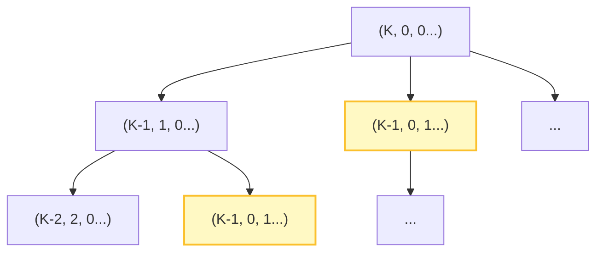
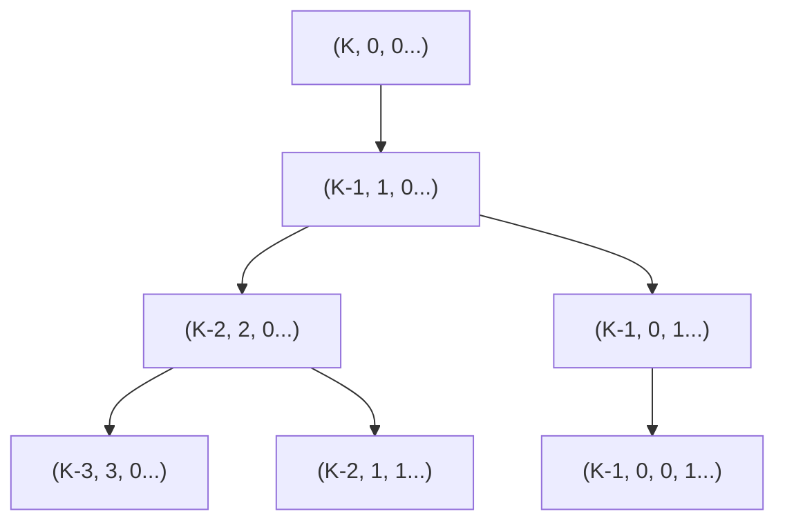

---
# src/content/blog/0002.md
title: 'ABC440'
pubDate: 2026-01-11
updatedDate: 2026-01-17
description: 'ABC440の振り返り'
author: 'shu8Cream'
tags: ["競プロ", "二分探索"]
---

<a href="https://atcoder.jp/contests/abc440" target="_blank">ABC440</a>の振り返りです。

- A: やるだけ
- B: インデックスを含めてソート
- C: $\bmod 2W$ で分類し、累積和を使い、開始位置をずらしながら幅 $W$ のコストで最小を探す
- D: WA, 区間を`set<pair>`で管理する構造体を使ったが計算量的にNGだった <a href="https://atcoder.jp/contests/abc440/tasks/abc440_d" target="_blank">問題文</a> [自分の解法](#d---forbidden-list-2)
- E: Upsolve, 多重集合の構築をシミュレーションする必要がある

## D - Forbidden List 2

### 誤った解法の解析
#### アルゴリズムの概要
[区間を`set<pair>`で管理する構造体](https://rsk0315.hatenablog.com/entry/2020/10/11/125049)を使おうとしたが、計算量の解析に失敗していた。

暫定的な答えを $tar$ と置き、その範囲 $[base, tar]$ 内に含まれる禁止された数（$A$ の要素）の個数 $c$ を数え、その分だけ $tar$ を後ろにずらすという処理を繰り返した。

```cpp
ll base = s.mex(x);
ll tar = base + y - 1;
// ...
while(c){ // 範囲内にリストに内包される数字がある限りループ
    base = s.mex(tar + c); // 新しい範囲の始点候補
    // リストに内包される個数分だけ探索範囲を拡張する処理...
}
```

#### 計算量解析
問題点は while ループの回数。一度範囲を拡張した先に、再び新たな禁止数字が存在すると、再度ループが回る。

**最悪のケース**
例えば、$A$ の要素が飛び飛びに存在する場合（例: $A = \{10, 20, 30, \dots, 10N\}$）や、拡張した直後に1つずつ禁止数字が現れるようなケースでは、1回のクエリにつき $O(N)$ 回程度のループが発生する可能性がある。

### 正しい解法
答えそのものを二分探索する。
「答えが $P$ 以下であるとき、条件を満たす数は $Y$ 個あるか？」という判定問題に帰着させる。

判定条件:
$X$ 以上 $P$ 以下の整数の個数 - ($X$ 以上 $P$ 以下に含まれる $A_i$ の個数) $\ge Y$

$A$ はソート済みであるため、$A$ 内で $X$ 以上 $P$ 以下の個数は `lower_bound` を使って $O(\log N)$ で求まる。

[提出コード](https://atcoder.jp/contests/abc440/submissions/72397688)


## E - Cookies
最大値からのdiffを考えて、解析することで構築することができないか試していたが上手くできなかった。

自明な最大値から手続き的にそれより少し小さい値を探索する。これらを`priority_queue`で管理して常に最大値から少し小さい値を構築していく。



上図のオレンジのノードのように一度追加したパターンを再追加することを防ぐために管理が必要になるが、遷移をうまく考えると管理を省略できる。



[類題](https://atcoder.jp/contests/abc391/tasks/abc391_f)
こっちの方が簡単な気がする。